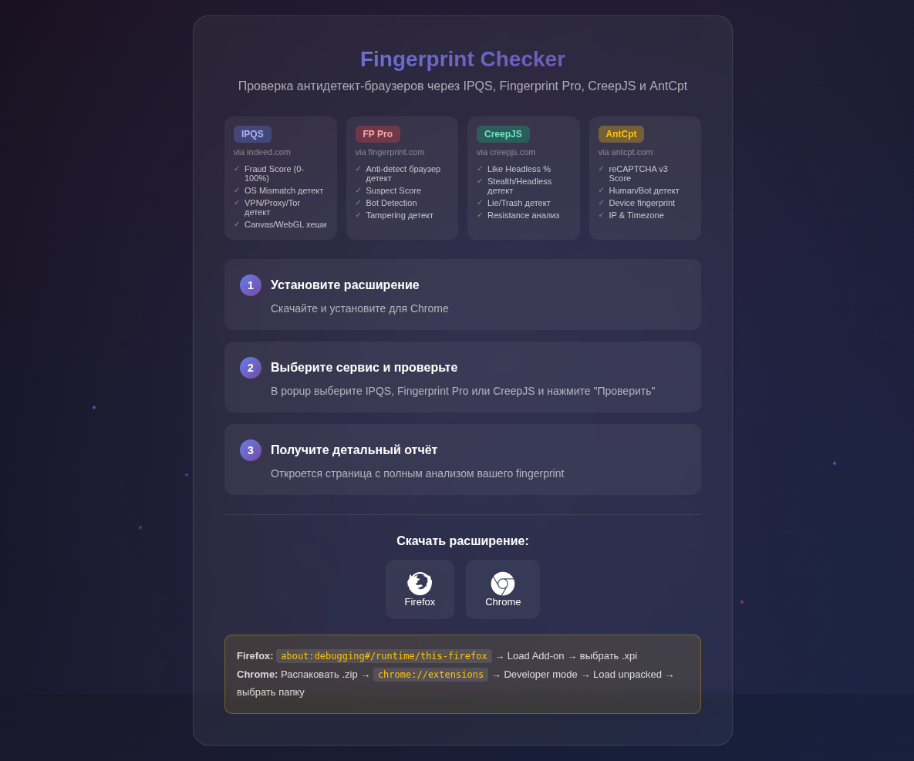
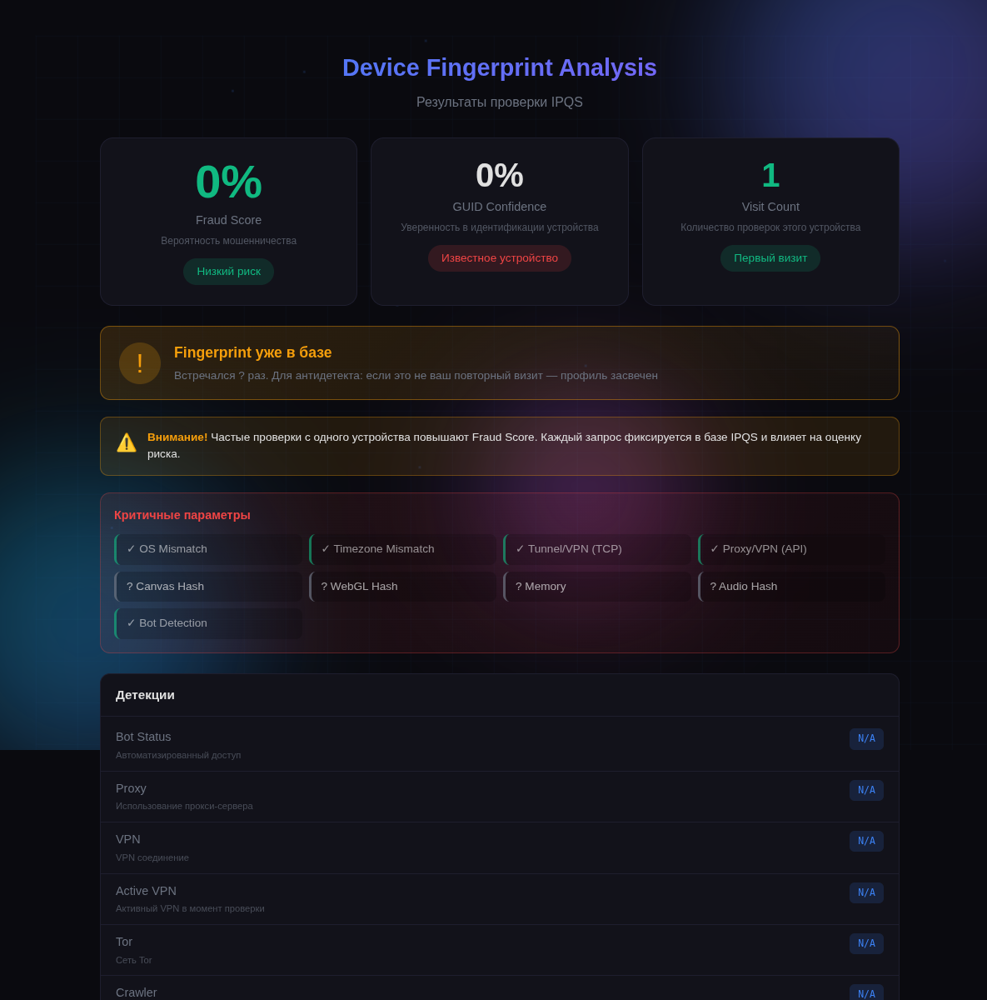
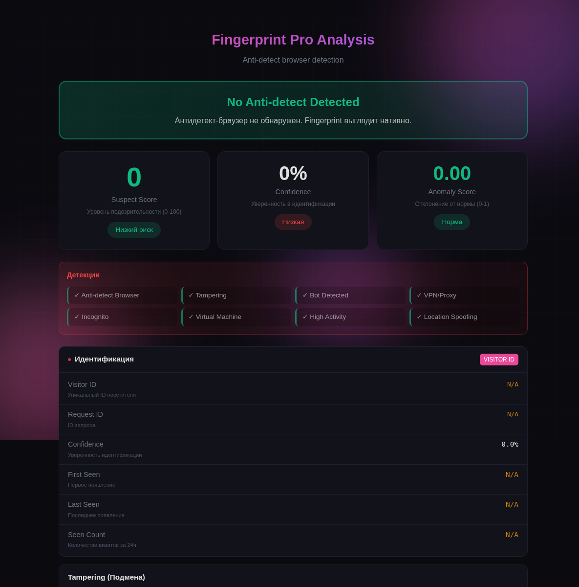
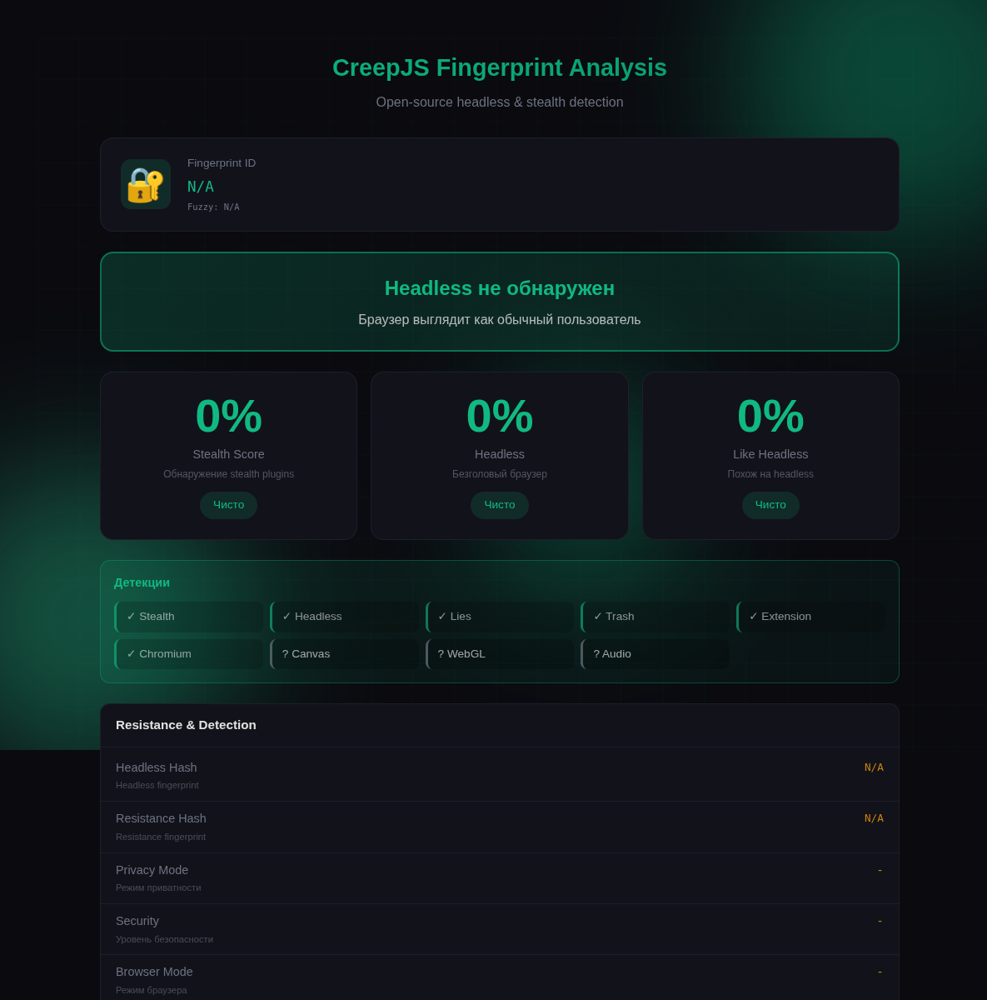
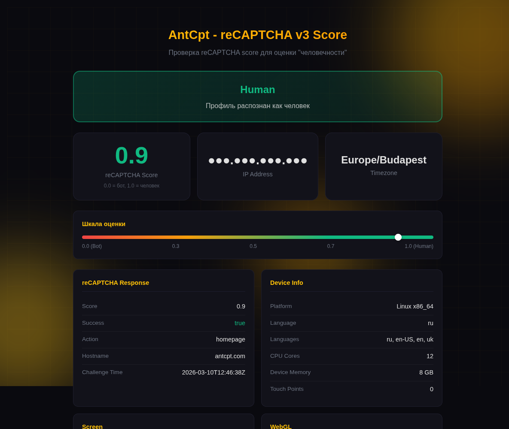
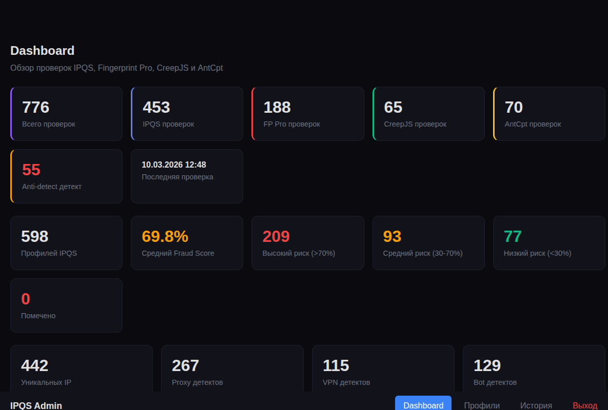

<div align="center">

# Fingerprint Checker

[](https://python.org)
[](https://fastapi.tiangolo.com)
[](https://postgresql.org)
[](https://docs.docker.com/compose/)
[](LICENSE)

**Multi-service fingerprint analysis platform for antidetect browser profiles**

Validates browser session quality through 4 independent fingerprinting services,
providing comprehensive risk assessment before production use.

[Live Demo](https://check.maxbob.xyz) ·
[Admin Panel](https://check.maxbob.xyz/admin) ·
[Download Extension](#extension-installation)

</div>

---

## What It Does

Fingerprint Checker intercepts and analyzes device fingerprint data from major anti-fraud services to assess the quality of antidetect browser profiles (Octo Browser, Multilogin, GoLogin, etc.).

| Service | What It Checks | Key Metrics |
|---------|---------------|-------------|
| **IPQS** (via indeed.com) | Device fingerprint fraud scoring | Fraud Score 0-100%, VPN/Proxy/Tor detection, OS mismatch, Canvas/WebGL/Audio hashes |
| **Fingerprint Pro** (fingerprint.com) | Commercial browser identification | Anti-detect browser detection, Suspect Score, Tampering detection, Visitor ID confidence |
| **CreepJS** (abrahamjuliot.github.io) | Open-source fingerprint analysis | Headless/Stealth detection %, Lie detection, Trash score, Resistance analysis |
| **AntCpt** (antcpt.com) | reCAPTCHA v3 scoring | Human/Bot score 0.0-1.0, Device fingerprint, GPU info, Platform analysis |

## Screenshots

<details>
<summary><b>Landing Page</b> — choose checker service</summary>


</details>

<details>
<summary><b>IPQS Result</b> — fraud score, detections, device info</summary>


</details>

<details>
<summary><b>Fingerprint Pro Result</b> — anti-detect browser detection, suspect score</summary>


</details>

<details>
<summary><b>CreepJS Result</b> — headless & stealth detection scores</summary>


</details>

<details>
<summary><b>AntCpt Result</b> — reCAPTCHA v3 score, device fingerprint</summary>


</details>

<details>
<summary><b>Admin Dashboard</b> — statistics, recent checks, country breakdown</summary>


</details>

## Architecture

```
┌──────────────────────┐     ┌──────────────────────┐
│  Chrome/Octo         │     │  Firefox Extension   │
│  Extension (MV3)     │     │  (MV2)               │
│                      │     │                      │
│  ┌─ content-ipqs.js  │     │  ┌─ background.js    │
│  ├─ content-fp.js    │     │  │  webRequest API    │
│  ├─ content-creep.js │     │  └─ content.js       │
│  ├─ content-antcpt.js│     │                      │
│  └─ injected*.js     │     │                      │
│     (fetch/XHR hook) │     │                      │
└──────────┬───────────┘     └──────────┬───────────┘
           │ POST /api/extension/report-*            │
           ▼                                         ▼
┌──────────────────────────────────────────────────────┐
│  FastAPI Backend (Python 3.12, async)                │
│                                                      │
│  ├─ /api/extension/report      IPQS fingerprint      │
│  ├─ /api/extension/report-fp   Fingerprint Pro       │
│  ├─ /api/extension/report-creep CreepJS              │
│  ├─ /api/extension/report-antcpt AntCpt              │
│  ├─ /api/extension/result/{id} Get results           │
│  ├─ /ipqs/{path}               Reverse proxy (IPQS)  │
│  └─ /admin/*                   Admin panel (JWT)     │
│                                                      │
│  Rate limiting (slowapi) · CORS · Path traversal     │
│  protection · JWT auth · Input validation            │
└──────────────────┬───────────────────────────────────┘
                   │
                   ▼
┌──────────────────────────────────────────────────────┐
│  PostgreSQL 16 (asyncpg)                             │
│                                                      │
│  profiles ─┐  Unique fingerprints (SHA256 hash)      │
│            │  Canvas + WebGL + DeviceID composite     │
│  checks ───┘  Individual verification results        │
│               4 services, JSONB raw responses         │
│               Fraud scores, detections, geo, ISP      │
└──────────────────────────────────────────────────────┘
```

### Data Flow (IPQS Example)

1. User clicks **"Check IPQS"** in extension popup
2. Extension clears indeed.com cookies/cache/localStorage
3. Opens `https://secure.indeed.com/auth` (IPQS-protected page)
4. `injected.js` intercepts IPQS API response via fetch/XHR monkey-patching
5. Fingerprint data sent to backend via `POST /api/extension/report`
6. Backend creates/updates Profile + Check in PostgreSQL
7. Extension polls `GET /api/extension/result/{session_id}`
8. Tab redirects to results page with full analysis

## Quick Start

### Docker (Recommended)

```bash
git clone https://github.com/mazamaka/ipqs-checker.git
cd ipqs-checker

# Configure environment
cp .env.example .env
# Edit .env: set POSTGRES_PASSWORD, ADMIN_PASSWORD, ADMIN_TOKEN_SECRET

# Start services
docker compose up -d

# Verify
curl http://localhost:8000/health
# {"status":"ok","timestamp":"..."}
```

### Local Development

```bash
python -m venv .venv && source .venv/bin/activate
pip install -r requirements.txt

# Requires running PostgreSQL
export POSTGRES_HOST=127.0.0.1
uvicorn app.main:app --reload --port 8000
```

## Extension Installation

### Chrome / Octo Browser (Recommended)

1. Download extension: [ipqs-checker-chrome.zip](https://check.maxbob.xyz/download/extension-chrome.zip)
2. Extract the archive
3. Open `chrome://extensions/` → Enable **Developer mode**
4. Click **Load unpacked** → Select extracted folder
5. Pin the extension to toolbar

### Firefox

1. Open `about:debugging#/runtime/this-firefox`
2. Click **Load Temporary Add-on...** → Select `extension/manifest.json`

> **Note:** Temporary extensions are removed on Firefox restart. For permanent installation, use the `.xpi` file from [dist/](https://check.maxbob.xyz/dist/ipqs-checker-firefox.xpi).

## API Reference

### Public Endpoints

| Method | Path | Description |
|--------|------|-------------|
| `GET` | `/` | Landing page |
| `GET` | `/result` | IPQS results page |
| `GET` | `/result-fp` | Fingerprint Pro results |
| `GET` | `/result-creep` | CreepJS results |
| `GET` | `/result-antcpt` | AntCpt results |
| `GET` | `/health` | Health check |

### Extension API

| Method | Path | Description |
|--------|------|-------------|
| `POST` | `/api/extension/report` | Submit IPQS fingerprint |
| `POST` | `/api/extension/report-fp` | Submit Fingerprint Pro data |
| `POST` | `/api/extension/report-creep` | Submit CreepJS data |
| `POST` | `/api/extension/report-antcpt` | Submit AntCpt data |
| `GET` | `/api/extension/result/{session_id}` | Poll check results |

### Admin Panel (JWT-protected)

| Method | Path | Description |
|--------|------|-------------|
| `GET` | `/admin` | Dashboard with statistics |
| `GET` | `/admin/profiles` | Profiles list (pagination, search, filters) |
| `GET` | `/admin/profile/{id}` | Profile detail with check history |
| `GET` | `/admin/history` | All checks (filterable by service) |
| `POST` | `/admin/api/profile/{id}/flag` | Flag suspicious profile |

### IPQS Reverse Proxy

| Method | Path | Description |
|--------|------|-------------|
| `GET/POST` | `/ipqs/{path}` | Proxy to IPQS CDN with `learn.js` patch |

## Result Interpretation

### IPQS Fraud Score

| Score | Risk Level | Meaning |
|-------|-----------|---------|
| 0-25% | Low | Clean profile, safe to use |
| 25-50% | Medium | Monitor for changes |
| 50-75% | High | Potential detection, review settings |
| 75-100% | Critical | Profile likely compromised |

### Key Detection Flags

| Flag | What It Means |
|------|--------------|
| **OS Mismatch** | Reported OS differs from actual (antidetect misconfiguration) |
| **Timezone Mismatch** | Browser timezone doesn't match IP geolocation |
| **Proxy/VPN Detected** | Network-level detection (bad proxy quality) |
| **Bot Status** | Automated behavior patterns detected |
| **Anti-detect Browser** | Fingerprint Pro detected browser spoofing |
| **High Stealth %** | CreepJS headless/stealth detection score |

## Project Structure

```
ipqs-checker/
├── app/                           # FastAPI application
│   ├── main.py                    # Server, routes, IPQS proxy
│   ├── config.py                  # Pydantic Settings with validation
│   ├── db/
│   │   ├── database.py            # AsyncEngine, connection pooling, migrations
│   │   └── deps.py                # FastAPI dependency injection
│   ├── models/
│   │   ├── profile.py             # Profile model (unique fingerprints)
│   │   └── check.py               # Check model (verification results)
│   ├── services/
│   │   ├── profile_service.py     # Profile CRUD, stats recalculation
│   │   └── check_service.py       # Check CRUD, aggregated statistics
│   ├── admin/
│   │   ├── auth.py                # JWT authentication (HS256)
│   │   ├── routes.py              # Admin endpoints with rate limiting
│   │   └── templates/             # Jinja2 templates (dashboard, profiles, history)
│   └── utils/
│       └── __init__.py            # Timezone-to-country mapping (131 zones)
├── extension-chrome/              # Chrome/Octo extension (Manifest V3)
│   ├── manifest.json              # Permissions, content scripts
│   ├── background.js              # Service Worker (session management)
│   ├── content-ipqs.js            # Indeed.com script injector
│   ├── content-fp.js              # Fingerprint.com interceptor
│   ├── content-creep.js           # CreepJS data extractor
│   ├── content-antcpt.js          # AntCpt score interceptor
│   ├── injected.js                # Fetch/XHR monkey-patch (IPQS)
│   ├── injected-fp.js             # Fetch/XHR monkey-patch (FP Pro)
│   ├── injected-antcpt.js         # Fetch/XHR monkey-patch (AntCpt)
│   └── popup.html / popup.js      # Extension UI
├── extension/                     # Firefox extension (Manifest V2)
├── static/                        # Frontend pages (HTML/JS)
│   ├── index.html                 # Landing page
│   ├── result.html                # IPQS results
│   ├── result-fp.html             # Fingerprint Pro results
│   ├── result-creep.html          # CreepJS results
│   └── result-antcpt.html         # AntCpt results
├── dist/                          # Packaged extensions (.crx, .xpi, .zip)
├── docker-compose.yml             # App + PostgreSQL 16
├── Dockerfile                     # Python 3.12-slim
└── requirements.txt               # Pinned dependencies
```

## Tech Stack

| Layer | Technology |
|-------|-----------|
| **Backend** | Python 3.12, FastAPI, Uvicorn, asyncio |
| **Database** | PostgreSQL 16, asyncpg, SQLModel/SQLAlchemy |
| **Auth** | JWT (PyJWT), cookie-based sessions |
| **Rate Limiting** | slowapi (per-IP) |
| **HTTP Client** | httpx (async) |
| **Templates** | Jinja2 |
| **Caching** | cachetools (TTLCache, in-memory) |
| **Extensions** | Chrome MV3 (Service Worker), Firefox MV2 (webRequest) |
| **Infrastructure** | Docker Compose, GitHub Actions CI/CD |

## Configuration

Create `.env` from the example:

```bash
cp .env.example .env
```

| Variable | Description | Default |
|----------|-------------|---------|
| `IPQS_API_KEY` | IPQS API key (optional, for proxy mode) | — |
| `IPQS_DOMAIN` | Domain for IPQS checks | `indeed.com` |
| `POSTGRES_HOST` | Database host (`db` in Docker) | `db` |
| `POSTGRES_PASSWORD` | Database password | — |
| `ADMIN_PASSWORD` | Admin panel password | — |
| `ADMIN_TOKEN_SECRET` | JWT signing secret | auto-generated |
| `PORT` | Server port | `8000` |
| `WORKERS` | Uvicorn workers | `1` |

## Development

```bash
# Lint
ruff check app/

# Format
ruff format app/

# Type checking
mypy app/ --strict
```

## Troubleshooting

<details>
<summary>Extension not intercepting data</summary>

1. Verify the target site is accessible (indeed.com, fingerprint.com, etc.)
2. Check extension console: `chrome://extensions` → **Inspect** on service worker
3. Confirm server is running: `curl http://localhost:8000/health`
4. Check browser console on the target page for injection errors
</details>

<details>
<summary>Database connection errors</summary>

- Use `POSTGRES_HOST=db` in Docker, `127.0.0.1` locally
- Check container: `docker compose ps`
- Review logs: `docker compose logs db`
</details>

<details>
<summary>Results not displaying</summary>

- Check browser console for JavaScript errors
- Verify API: `curl http://localhost:8000/api/extension/result/{session_id}`
- Ensure PostgreSQL has data via admin panel
</details>

## Author

**Maksym Babenko**

[](https://github.com/mazamaka)
[](https://t.me/Mazamaka)

## License

MIT License — see [LICENSE](LICENSE) file for details.
